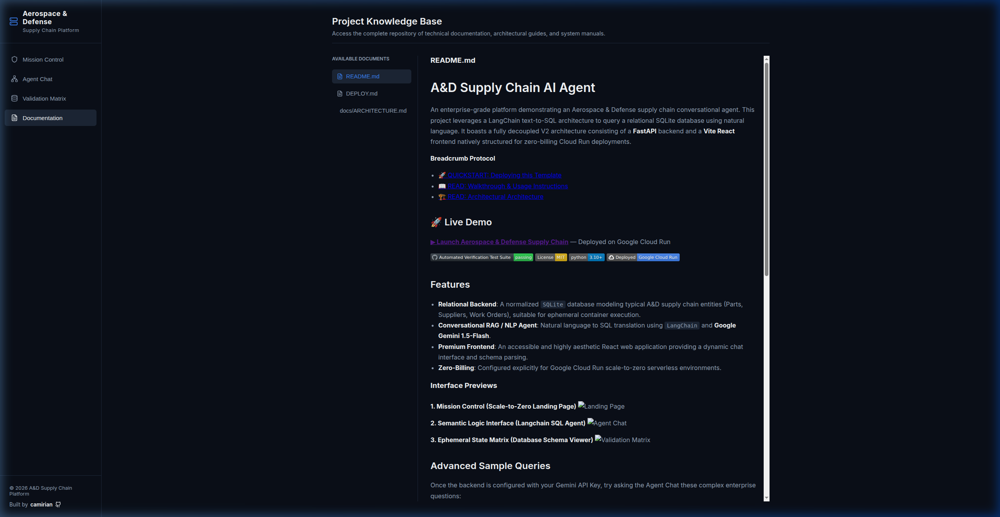

# A&D Supply Chain Platform — Deployment Walkthrough

## What Was Deployed

| Service      | URL                                                                                                                  | Technology            |
| ------------ | -------------------------------------------------------------------------------------------------------------------- | --------------------- |
| **Frontend** | [ad-supply-frontend-705975127752.us-central1.run.app](https://ad-supply-frontend-705975127752.us-central1.run.app)   | Vite React 19         |
| **Backend**  | [ad-supply-backend-705975127752.us-central1.run.app](https://ad-supply-backend-705975127752.us-central1.run.app)     | FastAPI + SQLite       |

**GCP Project:** `gen-lang-client-0364391286`  
**Region:** `us-central1`  
**Cost:** $0 (within free tier, scale-to-zero)

## Architecture Overview

The platform implements a fully decoupled, two-service Cloud Run architecture:

1. **Backend (FastAPI):** Hosts the LangChain text-to-SQL agent powered by Google Gemini. Exposes REST endpoints for chat (`/api/chat`), schema inspection (`/api/schema`), and documentation (`/api/docs`). The SQLite database is seeded at container build time.
2. **Frontend (Vite React):** A premium dark-mode SPA with four views — Mission Control, Agent Chat, Validation Matrix, and Documentation. Communicates with the backend via `VITE_API_BASE` environment variable.

## What Was Done

1. **Database Schema Design:** Created a normalized SQLite schema with `Suppliers`, `Parts`, and `WorkOrders` tables seeded with realistic A&D data.
2. **LangChain Agent:** Built `rag/nlp_agent.py` using `create_sql_query_chain` with `ChatGoogleGenerativeAI` (Gemini 2.5 Flash). Added a `clean_sql()` intercept function to strip Gemini's `SQLQuery:` prefix before execution.
3. **FastAPI Backend:** Created `backend/main.py` with CORS middleware, dynamic API key passthrough, and automatic model fallback detection.
4. **React Frontend:** Built a premium UI matching the Agentic Systems Verifier style — sidebar navigation, glassmorphism cards, suggestion chips, and an author footer.
5. **Cloud Run Deployment:** Deployed both services with `--min-instances 0 --max-instances 2` for zero-billing when idle.

## Post-Deployment Fixes & UI Enhancements

1. **SQL Syntax Error:** Gemini was prefixing generated queries with `SQLQuery:`, causing `sqlite3.OperationalError`. Fixed by adding a `clean_sql()` parsing function in the LangChain pipeline.
2. **Chrome Local Network Prompt:** The production frontend was falling back to `http://localhost:8000`. Fixed by creating `web/.env.production` so Vite bakes the Cloud Run backend URL into the production bundle.
3. **Model 404 Errors:** The hardcoded `gemini-1.5-flash` identifier was updated to `gemini-2.5-flash` with dynamic model discovery fallback.
4. **Global Breadcrumb Navigation:** Implemented a unified `PageNavigation` component across all pages for consistent breadcrumb tracking.
5. **"How It Works" Button:** Added a global entry point to documentation in the top-right corner of every page.
6. **Unified Layout:** Removed `max-width` constraints to provide a consistent Full-Width experience across all application sections.

### Redesigned Documentation Interface


## Verification

Both services confirmed live:
```
Backend /health → {"status": "ok"}
Frontend HTTP 200 → Landing page renders correctly
Agent Chat → Successfully queries SQLite via Gemini LLM
```

## Files Created/Modified

- `backend/main.py` — FastAPI application with chat, schema, and docs endpoints
- `backend/db_init.py` — SQLite schema definition and seed data
- `rag/nlp_agent.py` — LangChain text-to-SQL agent with `clean_sql()` parser
- `web/src/App.jsx` — React SPA with 4-view sidebar navigation
- `web/src/App.css` — Premium dark-mode design system
- `web/.env.production` — Production API base URL for Cloud Run
- `Dockerfile.backend` — Python 3.10-slim container with db_init at build time
- `Dockerfile.frontend` — Node 20 Alpine multi-stage build with `serve`
- `.dockerignore` — Excludes venv, node_modules, logs from build context
