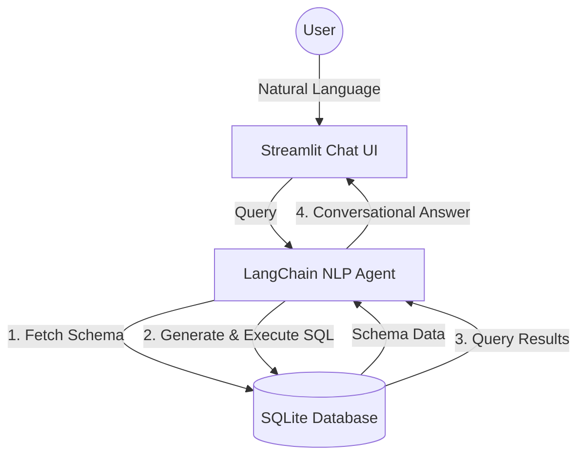

# System Architecture & Database Design

This document details the backend architecture, schema design, and NLP abstraction layer for the A&D Supply Chain AI Agent.

## Overview
The platform connects a conversational Streamlit frontend to an underlying relational SQLite database using LangChain's text-to-SQL logic. This allows users to ask unstructured questions and receive structured data analysis in return.

## Relational Database Architecture

The core relational database modeled in SQLite (`data/supply_chain.db`) follows standard third normal form (3NF) principles to reflect typical depot production control environments. 

### Tables and Relationships

1. **Suppliers**:
   - `supplier_id` (PK)
   - `name`: E.g., 'AeroTech Dynamics'
   - `rating`: Float value out of 5.0
   - `certification_status`: String (e.g., AS9100D, NADCAP)
   - `contact_info`: Contact string.

2. **Parts**:
   - `part_id` (PK)
   - `part_number`: (Unique) E.g., 'PT-1001'
   - `description`: Text descriptor
   - `supplier_id` (FK): Links to `Suppliers`
   - `lead_time_days`: Integer
   - `unit_cost`: Float
   - `stock_quantity`: Integer

3. **WorkOrders**:
   - `wo_id` (PK)
   - `part_id` (FK): Links to `Parts`
   - `status`: ['Open', 'In Progress', 'Blocked', 'Completed']
   - `priority`: ['Low', 'Medium', 'High', 'Critical']
   - `due_date`: ISO 8601 Date String
   - `notes`: Text

## NLP Abstraction Layer & Text-to-SQL

The `rag/nlp_agent.py` module encapsulates the complexity of querying the database.
Using LangChain's `create_sql_query_chain`:
1. The agent inspects the `sqlite://` URI and fetches the DDL schema for the three tables.
2. An LLM (by default, `gpt-4o-mini`) uses this context alongside the user's prompt to synthesize a syntactically correct SQL query.
3. The query is executed safely using `QuerySQLDataBaseTool`.
4. The raw database output (e.g., `[('Global Machining Solutions', 'PT-1002')]`) is passed back to the LLM via a custom `PromptTemplate` to produce a user-friendly conversational response.

### Security and Extensions
- Currently, the agent uses read-only capability by design, relying purely on SELECT queries to answer analytical questions. Next-gen enhancements may support conversational CRUD functions to update Work Order statuses interactively.
