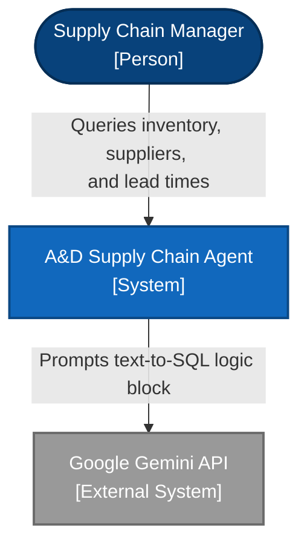
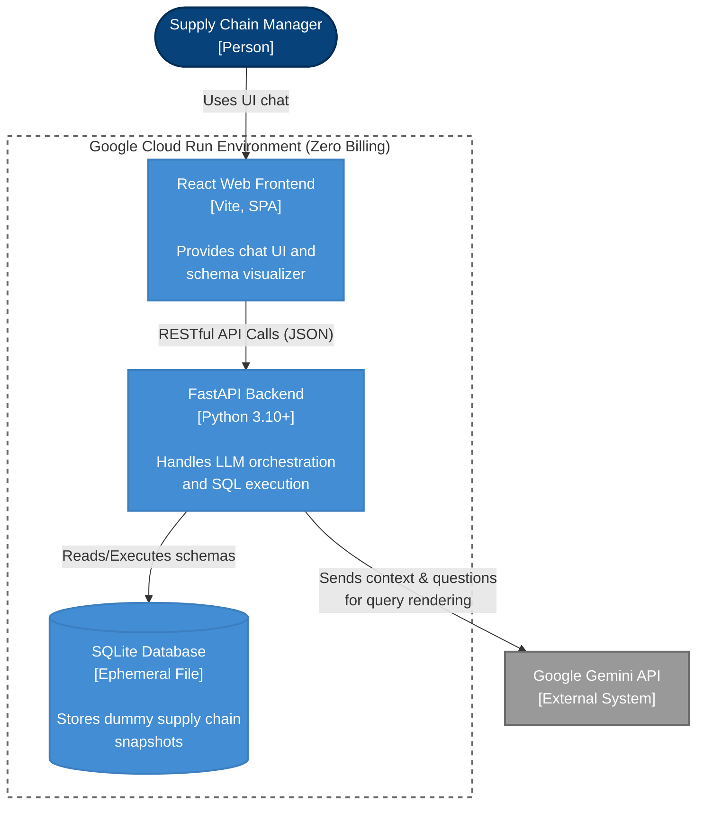
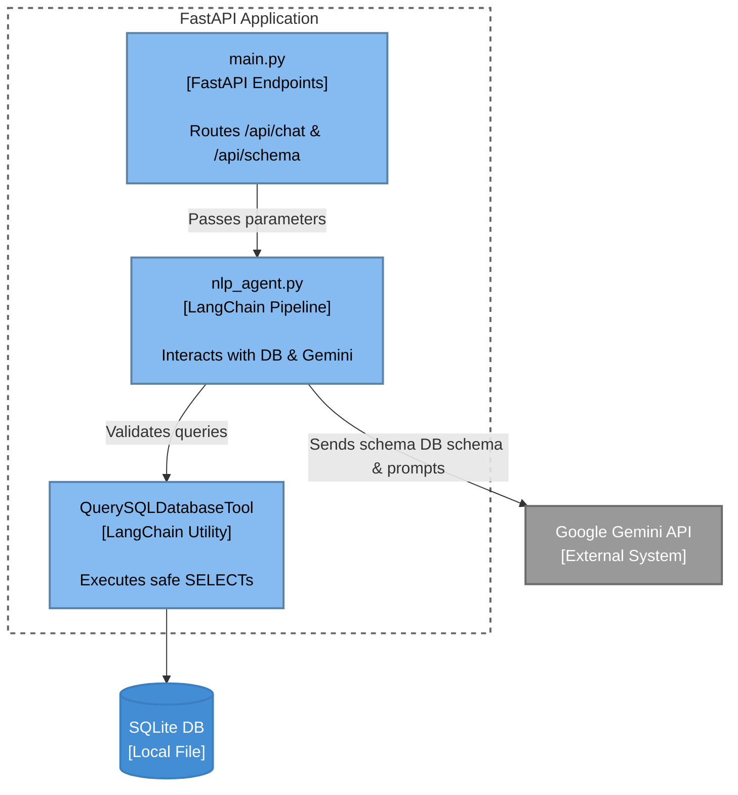

# System Architecture: A&D Supply Chain AI Agent

This document outlines the formal C4 (Context, Container, Component) architecture for the **A&D Supply Chain Platform**, pivoted to a decoupled FastAPI and React stack designed for zero-billing serverless execution on Google Cloud Run.

This formalization substantiates Applied AI Architect and Systems Engineering software design claims (`CPS_CAP_05`, `CPS_NAV_01`).

## 1. System Context Diagram
*The high-level view showing how users and external systems interact with the platform.*

## 2. Container Diagram
*The distinct deployable units that make up the software system.*

## 3. Component Diagram (Backend & Submodules)
*Zooming into the Python FastAPI Backend container to view internal logic blocks.*

## Architectural Design Decisions & Trade-offs
1. **Monolithic Storage (SQLite):** For MVP velocity and Cloud Run cost-controls (Scale to Zero), SQLite provides a simple, self-contained persistence layer perfectly demonstrating relational logic (`CPS_NAV_01`) without paying for Cloud SQL per-hour connectivity. 
2. **Decoupled Architecture**: By pivoting away from Streamlit to a FastAPI + React structure, the frontend UI and the backend logic can scale totally independently or be migrated to different serverless handlers (e.g. AWS Lambda / Cloudfront).
3. **Google Gemini Context Allocation**: Gemini `1.5-Flash` serves as an industry-leading zero-cost NLP pipeline. The `langchain-google-genai` integration isolates the complexity of context window tracking.
